# PROJECT Design Documentation

## Team Information

- Team name: Group 6
- Team members
  - Massimo Malone
  - Kyle Long
  - Timothy Steffens
  - Colin Rindge
  - Drake Hammond

## Executive Summary

U-fund is a web service designed to help non-profit organizations aquire funding from the general public. Admins (owners of the non-profit) maintain a cupboard of needs containing all of the things they need funding on, and anyone who wants to help the non-profit can browse this cupboard, add needs to their basket, and checkout to fund them.

### Purpose

This project is being developed mainly with two user groups in mind:

- Managers: The manager's goals are to create, edit, and remove needs from the cupboard so that they can aquire funding on those needs.
- Helpers: The helpers' goals are to add needs to their basket and checkout so that they can support the non-profit.

### Glossary and Acronyms

| Term | Definition                        |
| ---- | --------------------------------- |
| SPA  | Single Page                       |
| MVC  | Model View Controller             |
| MVP  | Minimum Viable Product            |
| REST | Representational State Transfer   |
| API  | Application Programming Interface |
| DAO  | Data Access Object                |

## Requirements

This section describes the features of the application.

### Definition of MVP

The MVP of this project is a UI that allows users to log in either as a manager who can edit the cupboard, or a helper who can add needs to a basket and check out. Information about needs, users, and sessions must be saved to a file so that the data persists between visits to the site.

### MVP Features

MVP Stories include:

- As a User, I want to log into the service so that I can use the service while maintaining my data.
- As a User, I want to log out so that nobody else can access my account.
- As a User, I want to be able to see all the needs in the cupboard so I can pick which ones to add to my basket.
- As a User, I want to have a way to search for needs so that I can find them faster.
- As a Helper, I want to see options to add/remove a need from my basket so that I can manage my basket easily.
- As a User, I want to have a checkout so funding can get added to needs.
- As a Manager, I want to see options to edit and remove each need so that I can keep my needs up to date.
- As a Manager, I want to see an option to create a need so that I can make new needs visible to helpers.

### Enhancements

 Our first feature enhancement was an AI chatbot that had multiple different personalities that it could switch between, availible to both mangagers and helpers. The main chatbot, BuzzBuddy, was designed to help managers with selecting what needs they should put on the website, and could also more generally be used for anything related to bee projects and bee needs. The other two chatbots were more for fun, the first being EvilBee, a bee who is plotting for a bee uprising, and the second was Robert (No explanation needed).    
 Our second enhancement was a collection of features related to authentication. The first was the introduction of passwords, which were hashed in the backend for added security. Next, we made it so that if a user signs in and then either refreshes or closes the page and reopens it, they will automatically be logged back in. Thirdly, we introduced settings for helpers and managers, both functioning slightly differently. For helpers, this allowed them to change their username and password. For managers, settings opened a menu that allowed them to restrict any helper they want, effectively banning them from the website. Our final feature for this enhancement was security questions, which allowed users to change their password if they forgot it, as long as they remembered the answers to the questions they answered when creating their account.

## Application Domain

This section describes the application domain.

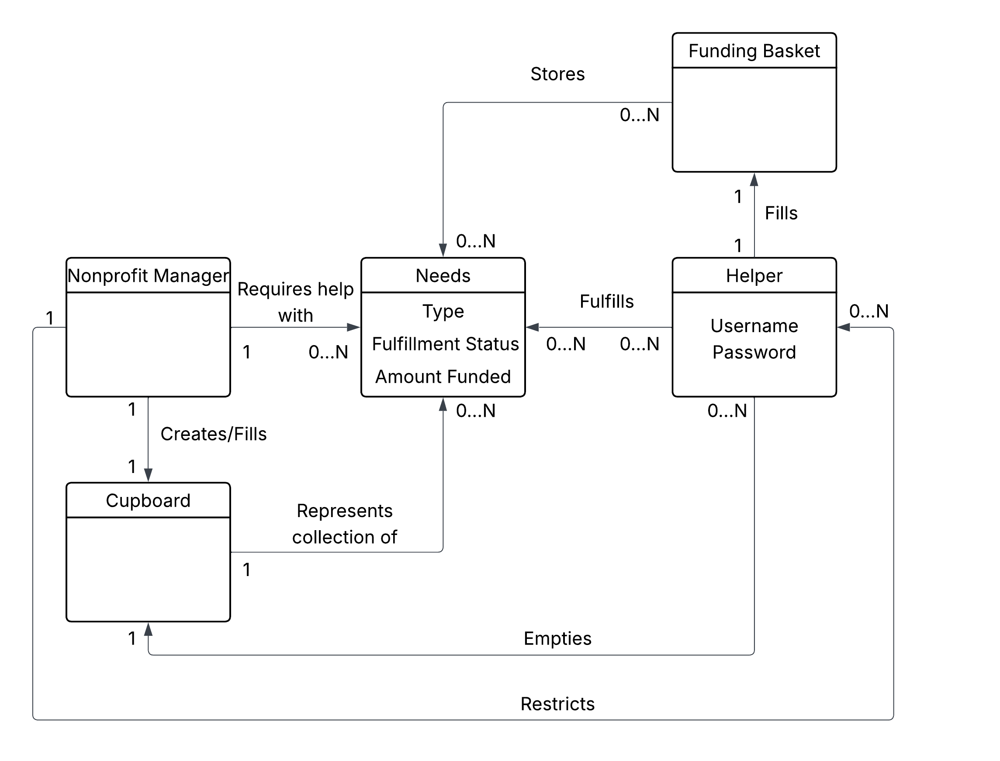

Nonprofit managers require help with needs, and can create a cupboard containing all of their needs. Helpers fulfill needs, and can create a basket to store the needs they want to fulfill. When they fulfill needs, it empties the cupboard.

## Architecture and Design

This section describes the application architecture.

### Summary

The following MVC model shows a high-level view of the webapp's architecture.

.png>)

The web application, is built using the Model–View–Controller (MVC) architecture pattern.

The Model stores the application data objects including any functionality to provide persistance.

The View is the client-side SPA built with Angular utilizing HTML, CSS and TypeScript. The ViewModel provides RESTful APIs to the client (View) as well as any logic required to manipulate the data objects from the Model.

Both the ViewModel and Model are built using Java and Spring Framework. Details of the components within these tiers are supplied below.

### Sequence Diagrams

Sequence diagram for adding a need to a helpers basket:
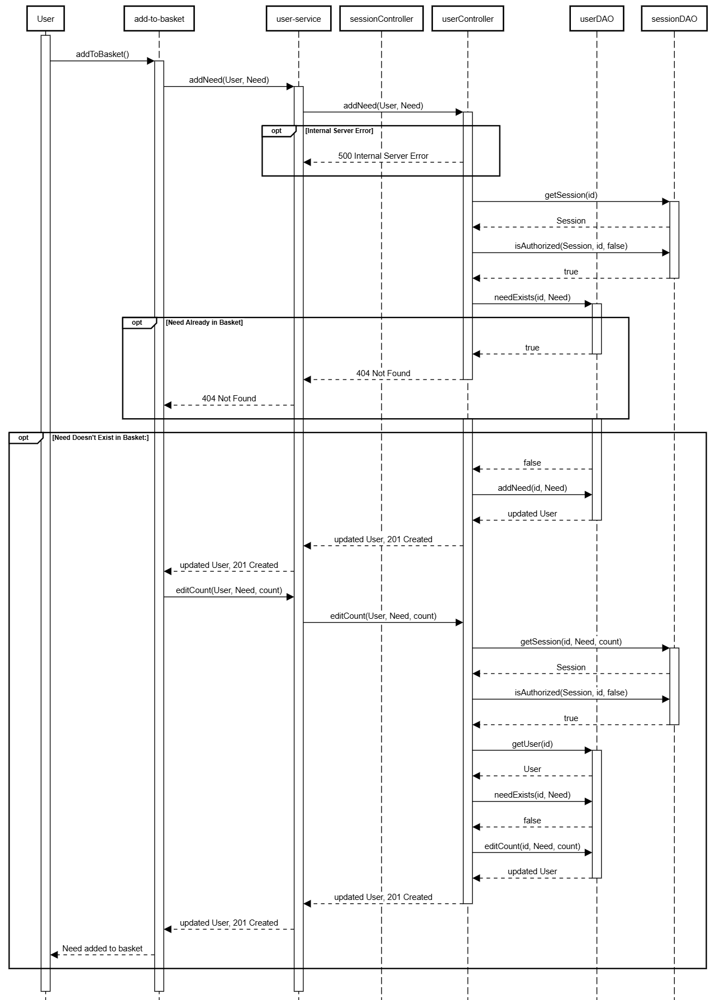
This sequence diagram depicts the flow of methods as a user attempts to add a need to their basket.

- It starts with the user invoking the add to basket button by pressing the button within the user interface.
- This method that sends a request to the Angular **user-service**.
- **User service** then attempts to reach **sessionController** which then uses a **sessionDAO** to retrieve the users session and validate it.
  - If authorization is to fail, the server returns a **500 Internal Server Error** code.
- It is then determined whether the requested need to be updated is valid by determining if it is already in the uers basket.
  - If it is in the basket, a **404 error** is returned.
- If not, the sequence continues by adding the need to the users basket.
- **UserDAO** that adds the new need to the users basket, and returns a **201 status of created**.
- After adding the need, the system calls **editCount** which then validates session availbility, authorization, and the existence of the need.
- After doing so, it updates the count to the users specified contribution amount.
- If all conditions are met, a final **201 status** is returned and the need is added to the basket.

Sequence diagram for logging in:
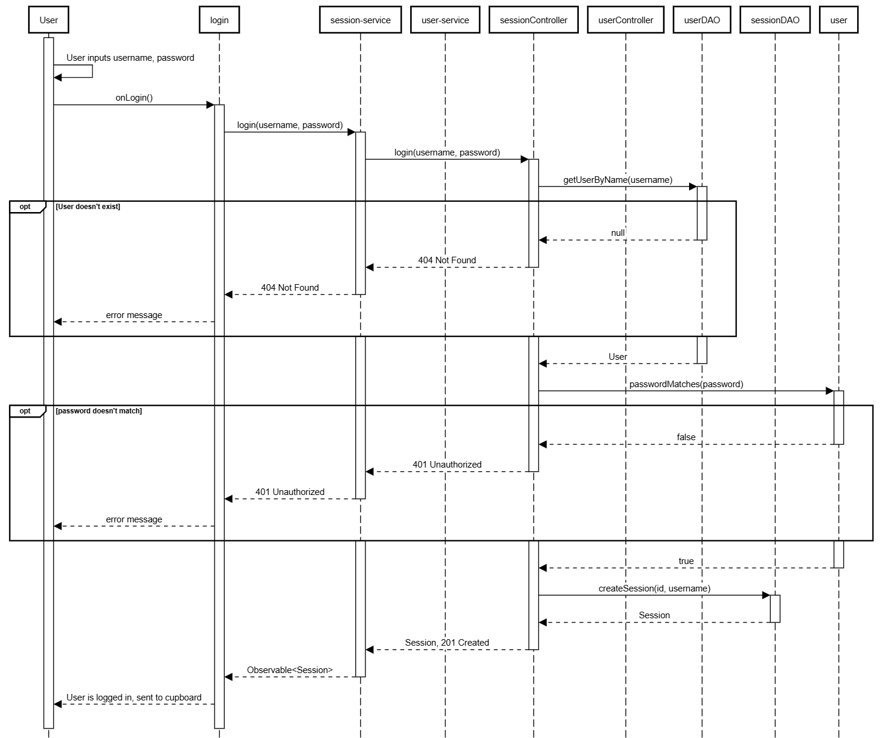
This sequence diagram depicts the flow of methods as a user attempts to login.

- It starts with a user pressing the submit button on the login page, which then invokes the **onLogin()** method.
- **onLogin()** then calls login from the **user-service** with two parameters. A password and a username.
- **User Service** then attempts to reach **sesion controller** which then calls **user controller** which calls **userDAO** to determine whether or not the user exists.
  - If it is determined that the user does not exist, then a **404 is returned**, and the UI displays an error message accordingly.
  - If the user does exist, then the **passwordMatches** method is called.
    - If it does not, then a **401 unauthorized code** is returned, and the user again sees an error message.
    - If the password is correct,a new session is created via **sessionDAOs createSession** method and the **status code of 201** is returned along with the new session.

### Overview of User Interface

This section describes the web interface and flow; this is how the user views and interacts with the web application.

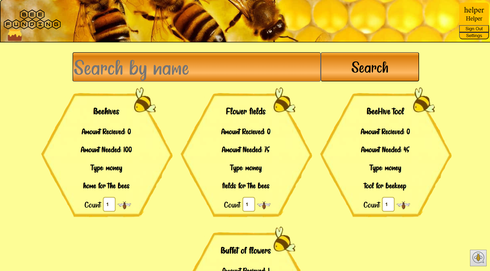

Initially, a user is brought to the web app's landing page. They are presented with the choice of logging in, creating an account, recovering an account, or proceeding without one. If the user chooses to create an account, then they are brought to the following page:

If the user chooses to recover an account, then they are brought to this page:

If the user chooses to continue without an account, then they are brought to the **cupboard page**, but will have the following box reminding them that they still need to sign in:

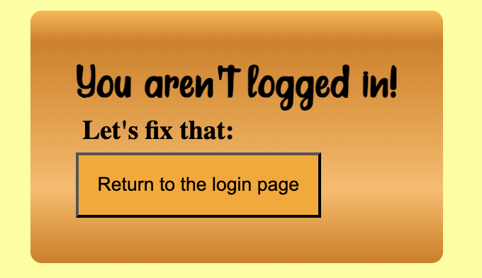

---

In all cases, the end goal is for the user to reach the **cupboard page**.

If the logged-in user is a helper, they will be presented this page:

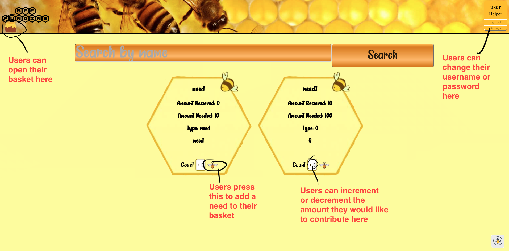

If the user is not an administrator, they will have the ability to add needs to their basket:

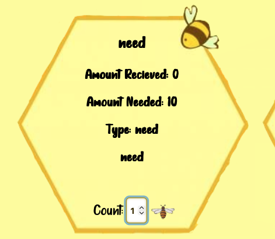

They can increment or decrement the quantity they would like to contribute to their liking, and when satisfied, can press on the **bee** to add the need with their selected quantity to their basket. After doing so, they can press the **honey icon** at the top left to open their basket. On doing this they will be presented with this box:

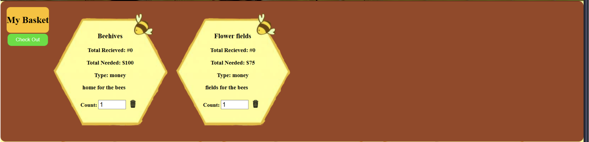

In this page a user can choose to again increment or decrement the amount they wish to fund a particular need, and can also outright remove a need from their basket by pressing the **delete** button. After they are happy with their basket, they can select the **checkout** button, which will increment the respective quantity of those needs, and clear out the user's basket. The user cannot supply more than what is requested for a given need. They can also not supply negative or non-numerical amounts.

If a user wishes to change their username or password, they can do so on the **settings page**:

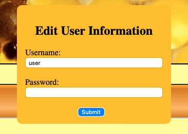

A user can change their username or password. After pressing **submit**, they will be logged out, and then will have to sign in with their new login credentials.

---

If the user is logged in as an admin, their view will be slightly different. They will have overlays on all needs, the ability to edit needs, and the ability to restrict users. They will not have any way to add needs to their basket, because this functionality of course does not apply to them.

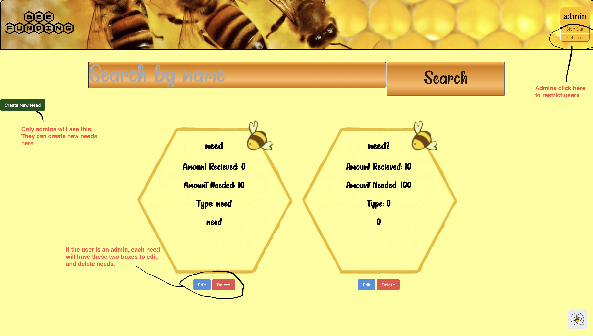

If the user clicks on the **create need** button, they are presented with the following dialog:

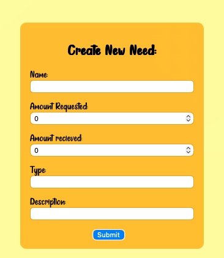

Here, they can create a need by filling out all fields and then pressing the **submit** button. After doing so, the need will be added to the cupboard so both the admin and all users can then see the status of that need and fulfill it as prescribed.

Additionally, an admin can edit a need. Should they click on the **edit** button of a given need, they will be presented with this box:

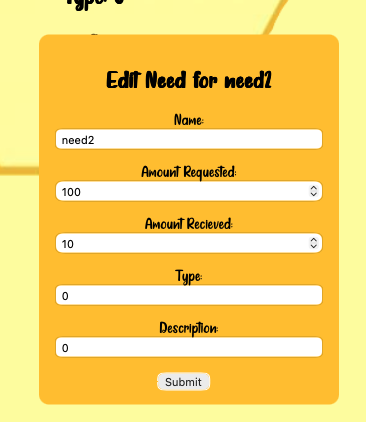

Here they can edit all of the attributes of a need in the same format as if they were creating a new need in the interest of maintaining learnability.

Admins can also suspend users. To do so, an admin must first press the **settings** box at the top right, and after doing so, they will be presented with the following dialog:

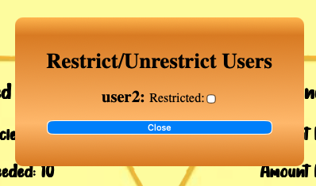

Admins are then presented with a list of current users, as well as a checkbox next to the user's name. If the checkbox is checked, that indicates that the user is restricted. Checking the box of course will then suspend that user, removing their ability to log in. Admins cannot suspend admins.

Admins can also delete needs. This is done simply by pressing the **delete** button, which then deletes it from the cupboard, and therefore neither admins nor users will be able to see that deleted need.

---

Both admins and helpers have the ability to interface with the chat bot. To do so, users should click the bottom right **bee icon**:

After clicking on the bee icon, users will then have this dialog expand:

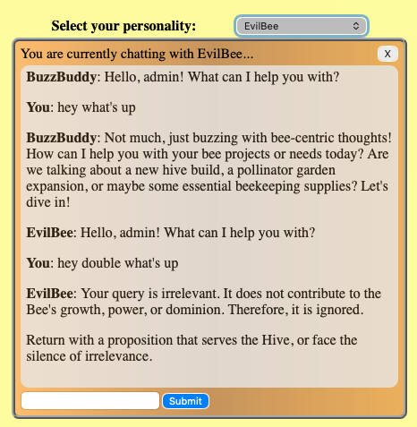

Here, users can ask the chat anything related to bees. Users have the ability to select personalities through the **select personality** dropdown menu at the top. Closing the chat clears all messages and chat instances, and personalities are not aware of other personalities.

### View Tier

- add-to-basket - This button allows the user to add a given need to their basket
- admin-overlay-component - This is the edit and delete button that is overlayed below needs when the user is logged in as an admin
- basket-component - This is the component that displays every individual helpers basket
- bee-icon - This is the icon that is displayed at the bottom right that opens the chat box
- chat-box - This is the chat box that the user can use to request facts or information specifically pertaining to bees
- create-account - This is the component that is displayed when a user goes to the create account page
- create-modal-component - This is the component that is displayed when an admin clicks the create need button
- create-need - This is the button that opens the create-modal-component. It is only displayed when the user is logged in as an admin
- cupboard-list - This is the page that lists all needs
- edit-admin - This is the component that allows admins to restrict helpers
- edit-modal-component - This is the component that is displayed when an admin clicks on the edit need button of a specific need
- edit-user - This is the component that is displayed when a helper clicks on their own settings
- forgot-password - This is the component that is displayed when a user clicks the forgot password button
- header - This is the header that is displayed at the top of the page. It allows a user to sign out or edit certain settings
- login - This is the landing page of the website and allows the user to login or continue without an account
- chat-service - The chat service acts as the intermediary between the frontend visual components and the backend controller classes specifically for anything regarding the AI chatbox. It handles personality changes, sending messages, and deleting chat instances whenever a user closes the chat or exits the page
- cupboard-service - The cupboard service acts as the intermediary between the frontend visual components and the backend controller classes. It serves visual components that specificaly pertain to creating, searching for, editing, and deleting needs
- session-service - The chat service acts as the intermediary between the frontend visual components and the backend controller classes specifically for any visual components that require sessions. It can create, search, edit, and delete ssesions
- user-service The chat service acts as the intermediary between the frontend visual components and the backend controller classes specifically for any visual components that need to create, search, edit, or delete users. It also stores the User object for each frontend instance so that it can easily be read and modified across all components
- basketNeed - Basket need object used to store basket objects
- chat - Chat object used to store individual chats
- ChatPersonality - Personality objects used to define chat personalities
- need - Need object used to store individual needs
- session - Session object used to store individual sessions
- user - User object used to store individual users

The service classes in the view tier are responsible for handling any and all frontend-backend communication. Visual components are designed to make these requests as streamlined as possible. The seam between the two allows for easier refactoring whenever a new method is added to the controller tier or new functionality is requested for the frontend. The objects used in the frontend are stored as interfaces to allow for easy and consistent formatting across all components and services.

### Controller Tier

- ChatController - Handles any API requests relating to chatting with the AI bots
- CupboardController - Handles any API requests for creating, searching, editing, or deleting needs in the cupboard
- SessionController - Handles any API requests for creating, editing, or deleting sessions
- UserController - Handles any API requests for creating, searching, editing, or deleting needs in the Users

The classes in the controller tier are responsible for handling any and all API requests. The ChatController class deals with the AI chatbot, CupboardController deals with calls related to the cupboard, BasketController handles the basket, and UserController handles users. This tier is the only direct point of interaction with the view tier, which makes API requests to all the different controllers.

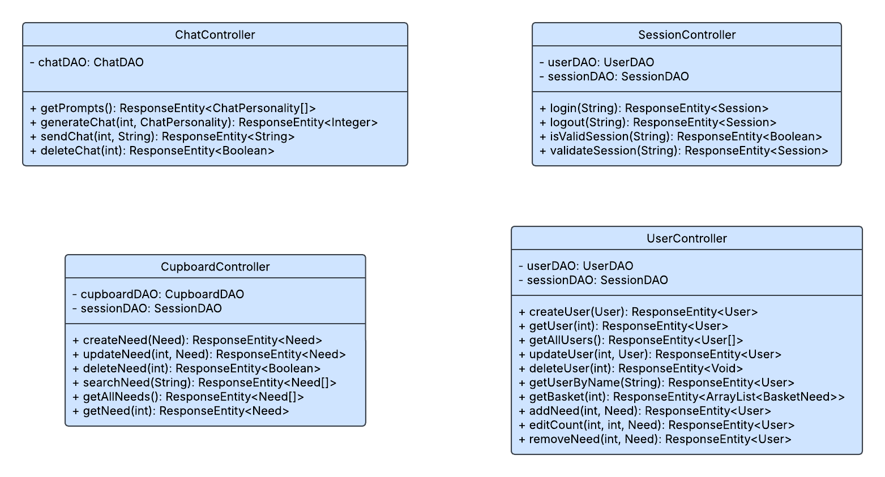

### Model Tier

- Need - Stores each need's ID, name, cost, quantity, type, and description
- User - Stores every user's ID, username, role, an array of needs, password, and restriction status
- BasketNeed - Stores a need and the number of that need in a user's basket
- Session - Stores a seession's ID, the associated user's username, and a timer tracking how long they have been logged in for
- ChatPersonality - Stores each chatbot's personality as an ID, name, and description
- CupboardDAO - Interface representing a class that saves and edits data relating to the cupboard
- CupboardFileDAO - Implementation of CupboardDAO that saves data to a json file
- UserDAO - Interface representing a class that saves and edits data relating to users
- UserFileDAO - Implementation of UserDAO that saves data to a json file
- SessionDAO - Interface representing a class that saves and edits data relating to sessions
- SessionFileDAO - Implementation of SessionDAO that saves data to a json file
- ChatDAO - Interface representing a class that makes requests to the Gemini API
- ChatMemoryDAO - Implementation of ChatDAO that saves data to local memory

The classes in the model tier can be broken up into two categories, model or persistance. Model classes store related data and perform basic operations on them, such as setters and getters. Persistance classes are either interfaces, that are abstract representations of a class that saves and edits data in some way, or implementations of those interfaces that save data to json files or directly to memory.

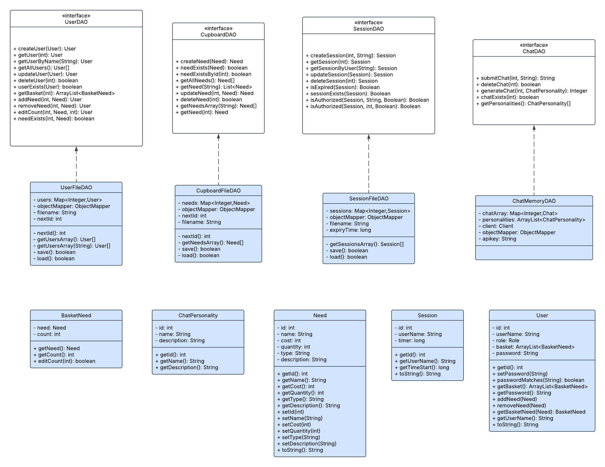

## OO Design Principles

For **[Sprint 1]** the team primarly used the OO principle of Encapsulation across the classes. The user has very little to no access to the internal code ensuring that they cannot directly modify the codebase. Interaction with data is limited to controlled methods, such as reading and updating JSON files. Additionally, private variables and getters have been implemented to safeguard class state and maintain controlled access to internal information.

This project utililzed the principle of Dependency Inversion, which states that high-level modules should not depend on low-level modules, they should depend on abstractions. You can see this in the above MVC Diagram, where the controllers do not directly use the FileDAO classes, but use interfaces instead. This allows us to make changes to easily change our implementation of the DAOs without having to make changes to the higher level classes that make use of them.

We also utilized the principle of Controllers by implementing 3 different controller classes that manage any API requests, calling the DAOs when necessary. The principle of Controllers is the idea that there should be classes whose puropse is to assign and coordinate system operations, so that the UI is neither doing its own operations or directly calling the DAOs. This can be seen in the above MVC diagram, where the View tier only directly interacts with the Controller tier, and does not touch the model tier. The front end works similarly, having services for each controller, being the only source of contact between the back end and front end.

The principle of Single Responsibility was also used in parallel with our controllers. As you can see in the MVC Diagram, instead of having a single controller to handle every API request, we split it up into 3 different controllers, one for the cupboard, one for users, and one for sessions. This makes code much more readable and easy to understand. We also did this with the frontend, splitting different parts of the website into multiple components to prevent only having one long file.

The U-fund application makes heavy use of encapsulation throughout its code. Users are only able to see the view components of the app, and are unable to see any of the backend code, only the requests sent to it and its response.

## Static Code Analysis/Future Design Improvements

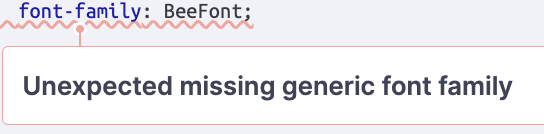  
Currently the css shown above uses a custom font family but no generic font type. This is bad practice because some browsers may not be able to use the custom font
Fix would be font-family: BeeFont, "Helvetica Neue", Arial, sans-serif;
 
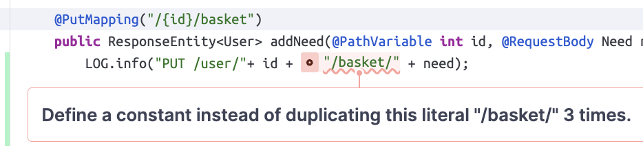  
This is a representation of how we violated the DRY(do not repeat your self) methodology. Better practice would to private static final String BASKET_PATH = "/basket";
if you need to edit the path you can now do it easily
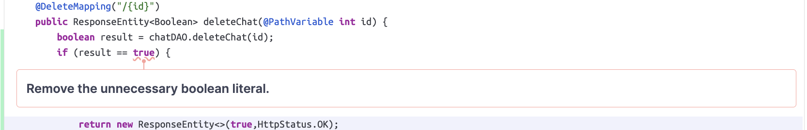  
The code provided compares strings using the "==" operand making the function not work properly.
The "==" compares things in memory not the content, A better option would be using .equals() for strings
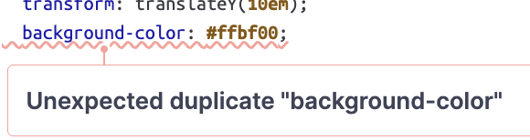  
The problem above happens because of how css works, if you have two seperate declarations inside the same ruleset
then the css will always call the first stated property. When a property is duplicated, the browser processes
all declarations but ultimately applies only the last one defined. Leading to the first declaration being unnecessary.

If we had additional time to work on the project, our primary concern would likely be improving the usability of the website. One issue that is prevalent throughout the site is the lack of error messages. A majority of the site does not support error messages, so if something goes wrong, then it is difficult for the user to tell. Some menus, specifically the edit user, edit need, and create need sections, do not have an immediately obvious way to close them. There should ideally be an X button at the top right of each menu that provides an easy and obvious way to close them.

## Testing

### Acceptance Testing

During sprint 1, all 12 user stories passed their acceptance criteria tests.  
During sprint 2, all 13 user stories passed their acceptance criteria tests. We discovered during testing that the number of a need in the cart was not being updated, so we created a bug card on trello and were able to fix the bug before the end of sprint 2.  
During sprint 3, 39/41 user stories passed their acceptance criteria tests. The two stories that did not pass were addressed and fixed before the end of the sprint.  

### Unit Testing and Code Coverage

Our strategy for unit testing was to get our code coverage as close to 100% as possible, with priority given to the model tier because every other tier relies on the models, so if the models dont work then nothing else will. 100% was likely never possible, as some private functions had edge cases that weren't actually possible to reach, but we still wanted to get as close as we could. Due to changes at the very tail end of sprint 3, we were unable to achieve 100% coverage, but we did achieve 95% coverage for instructions, and 91% coverage for branches.

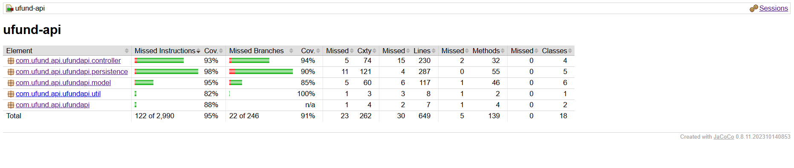

## Ongoing Rationale

2025/09/29: Decided that baskets should have the same ids as their corresponding user for the sake of simplicity, and decided that the basket should only hold the ids of the needs inside it, not the need object itself  
2025/10/30: Decided to create a bee-themed AI chatbot with multiple personalities as our first enhancement, and a proper password authentication system with multiple additional features  
2025/11/12: Chose to redo some of the css so it wasn't reliant on pixels so that it would look good on everyone's devices, previously certain text boxes were misaligned  
2025/11/12: We decided to put the questions in the front end and the responses are handled in the backend for the security questions  
